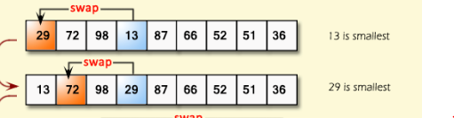

# Selection Sort 
- uses divide and conquer technique 
- where it divides the array into two section 
- first number is assumed to be always sorted thus assumed to be the smallest item here. 
- Thus first item always assumed to be sored. 
---


### phases in sorting 
- In Each phase sorting is done and size of the sorted array will increase and size of unsorted array will decrease. 
 - eventually there will be a point where there will be no unsorted array
 - the phase is done by finding the smallest value and replacing with one index at a time wih the lowest and moving it on the sorted list. 



-  this is the simple idea of selection sort 
- `29` assumed to be lowest here 
   - it will be compared to all the values in the array  
    - it finds `13` to be the smallest here. 
    - `13` will swap places with `29` since `13` is smaller than `29`

---
### Example step by step walkthrough. 
```
array = [32,8,29,-6,17,32,3,8,5,23]
```
## Index position of the table
| `0`    | `1` | `2`|`3`|`4`|`5`|`6`|`7`|`8`|`9`
| ---      | ---       |---       |---       |---       |---       |---       |---       |---       |---       |
| `32` | `8`| `29`|`-6`|`17`|`32`|`3`|`8`|`5`|`23`

- `32` is at index `0` is assumed to be smallest and assumed to be sorted
- `8`, `29`,`-6`,`17`,`32`,`3`,`8`,`5`,`23` assumed to be unsorted 

### Phase One 
- `32` is located at index `0`
- algorithm will find the smallest location on the the array which is `-6` at index 3
- thus `32` will be swapped at `-6` 
### phases after table standing 
| `0`    | `1` | `2`|`3`|`4`|`5`|`6`|`7`|`8`|`9`
| ---      | ---       |---       |---       |---       |---       |---       |---       |---       |---       |
| `-6` | `8`| `29`|`32`|`17`|`32`|`3`|`8`|`5`|`23`


- table standing has been changed 
- `-6` is sorted now as its at index `0`
- `32` is at index index `3` now

### Phase Two 
- Current array standing
```
[-6, 8, 29, 32, 17, 32, 3, 8, 5, 23]
```
- note than in here -6 is sorted 
- ` [8, 29, 32, 17, 32, 3, 8, 5, 23]` is not sorted 
- `8` will join the club of sorted which is -6;
- `8` is at index `1` will be compared with the rest of the array `3` which is at index `6`
### phases after table standing
| `0`    | `1` | `2`|`3`|`4`|`5`|`6`|`7`|`8`|`9`
| ---      | ---       |---       |---       |---       |---       |---       |---       |---       |---       |
| `-6` | `3`| `29`|`32`|`17`|`32`|`8`|`8`|`5`|`23`
- positions of `3` has changed to index `1`
-  positions of the `8` changed to index `6`
---
### Phase Three
`[-6, 3, 29, 32, 17, 32, 8, 8, 5, 23]`
- `-6` and `3` are both sorted now 
- `29` is assumed to be part of sorted club now
- `29` is at index `3` will look for the smallest  
-  `5` is at index `8` is the smallest thus it will be switched with each other. 

| `0`    | `1` | `2`|`3`|`4`|`5`|`6`|`7`|`8`|`9`
| ---      | ---       |---       |---       |---       |---       |---       |---       |---       |---       |
| `-6` | `3`| `5`|`32`|`17`|`32`|`8`|`8`|`29`|`23`
-  `5` is at indeex 2 
- `29` is at index 8 

### phase four 
- `[-6, 3, 5, 32, 17, 32, 8, 8, 29, 23]`

| `0`    | `1` | `2`|`3`|`4`|`5`|`6`|`7`|`8`|`9`
| ---      | ---       |---       |---       |---       |---       |---       |---       |---       |---       |
| `-6` | `3`| `5`|`32`|`17`|`32`|`8`|`8`|`29`|`23`
- `32` is at at index 3 will be swapped with `8` at index 6
` [-6, 3, 5, 8, 17, 32, 32, 8, 29, 23]`
  - `8` has been swapped to index 3 
  - `32` went to index 6
### phase 5    
- `[-6, 3, 5, 8, 17, 32, 32, 8, 29, 23]`
- `17` is at index 4 is not the biggest 
- `8` is at index 7 
   - Even though there are duplicates `8` is replaced first  then `8` is chosen after 
    
 `[-6, 3, 5, 8, 8, 32, 32, 17, 29, 23]`
- 2nd `8` is now at index 4
- `17` is at index 7
### Phase 6
`[-6, 3, 5, 8, 8, 32, 32, 17, 29, 23]`
- `32` at index 5 is not sorted 
-   `17` is at index 7; 

`[-6, 3, 5, 8, 8, 17, 32, 32, 29, 23]`
- `17` is at index 5
- `32` at index 7

### phase 7
- `[-6, 3, 5, 8, 8, 17, 32, 32, 29, 23]`
- `[-6, 3, 5, 8, 8, 17]` are sorted now
- `32` at index 6 is not sorted 
- `23` is at index 9 is the smallest 
-  swapping will be done
   
   `[-6, 3, 5, 8, 8, 17, 23, 32, 29, 32]`
- `17` now at index 6 
- `32` is at index 9 now 

### phase 8 
-  `[-6, 3, 5, 8, 8, 17, 23, 32, 29, 32]`
- `[-6, 3, 5, 8, 8, 17, 23]` is sorted now
-  `[32, 29, 32]` is not sorted 
- `32` is at index 7
-  `29` is at index 8 is the lowest 
- swap will be done between these two 
- `32` is at index 8 
- `29` is at index 7

`[-6, 3, 5, 8, 8, 17, 23, 29, 32, 32]`

###phase 9 sorting is completed.
`[-6, 3, 5, 8, 8, 17, 23, 29, 32, 32]`
- `[-6, 3, 5, 8, 8, 17, 23, 29]` are all sorted 
- `[32,32]` is not sorted 
-  `32` is at index 8 is not bigger than index 9 at `32`
    - `32` is not bigger than `32` no swapping will be done 
    
`[-6, 3, 5, 8, 8, 17, 23, 29, 32, 32]`
### Final sorting result

| `0`    | `1` | `2`|`3`|`4`|`5`|`6`|`7`|`8`|`9`
| ---      | ---       |---       |---       |---       |---       |---       |---       |---       |---       |
| `-6` | `3`| `5`|`8`|`8`|`17`|`23`|`29`|`32`|`32`
